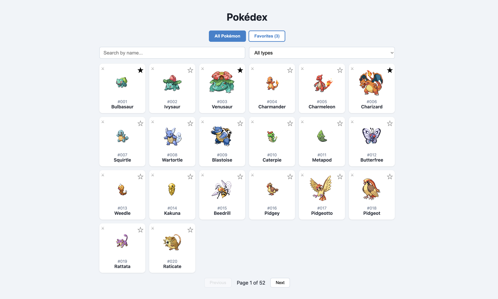
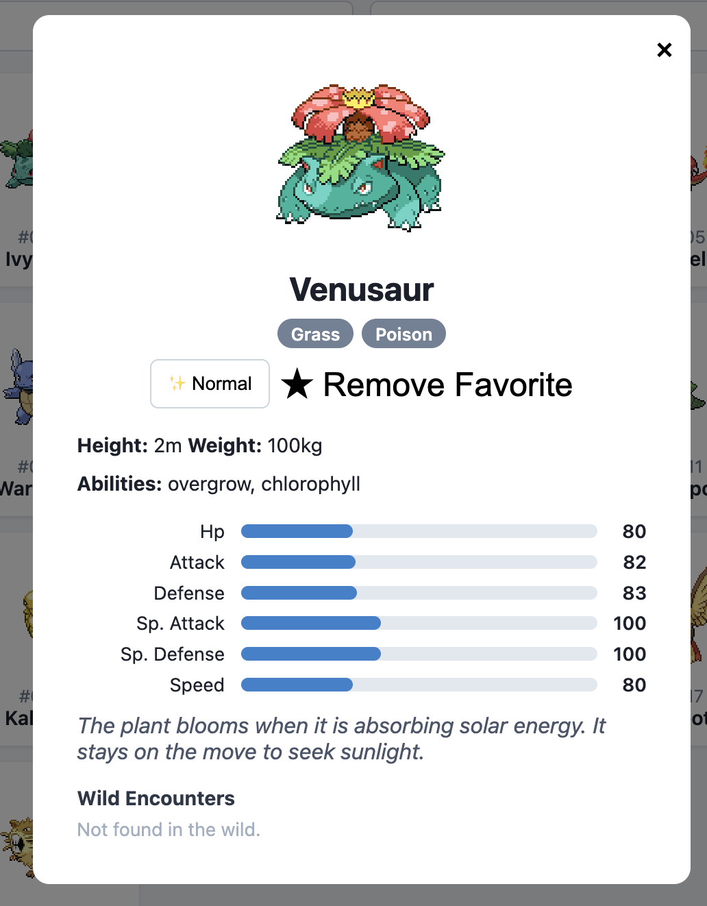
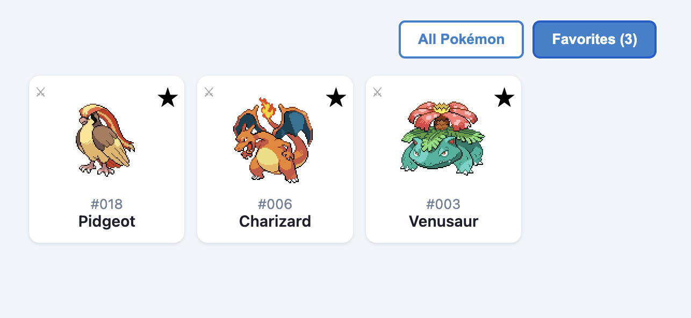
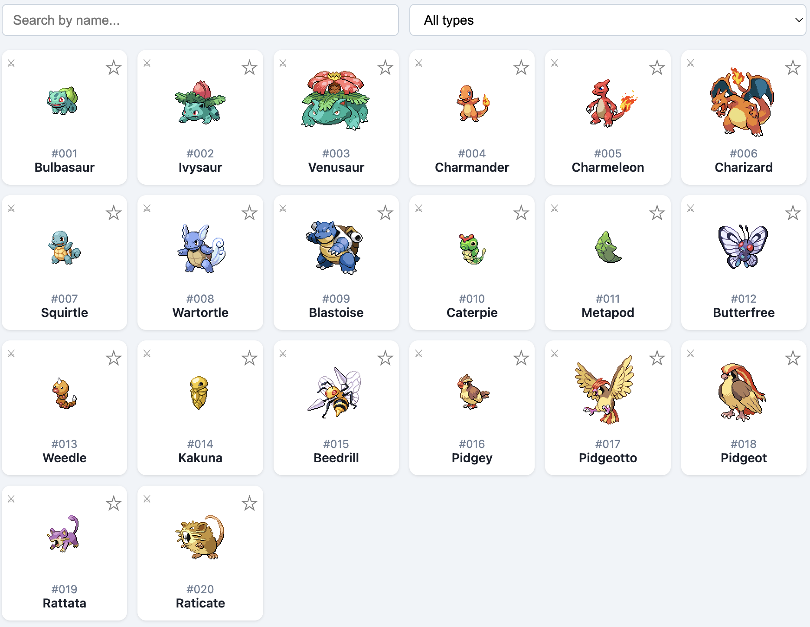
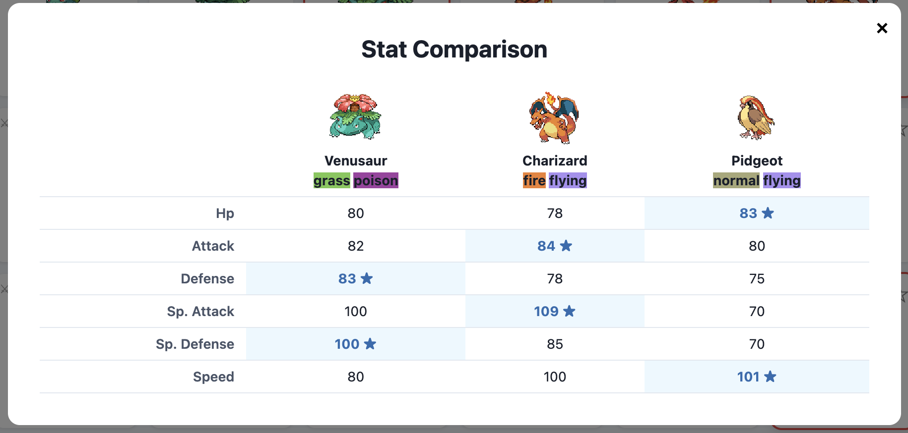
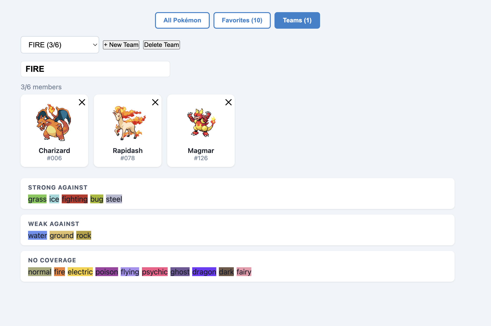

# Pokédex App

A full-stack Pokédex web application built with **FastAPI** and **React**. Browse, search, filter, and compare Pokémon — with a persistent favorites system, shiny sprite toggling, and encounter location data.

---

<!-- SCREENSHOT: Landing page showing the Pokémon grid with search/filter controls -->


---

## Table of Contents

- [Features](#features)
- [Tech Stack](#tech-stack)
- [Project Structure](#project-structure)
- [Getting Started](#getting-started)
  - [Docker (Recommended)](#docker-recommended)
  - [Local Development](#local-development)
- [Environment Variables](#environment-variables)
- [API Endpoints](#api-endpoints)
  - [Health & Info](#health--info)
  - [Pokémon](#pokémon)
  - [Favorites](#favorites)
  - [Teams](#teams)
  - [Types, Abilities & Stats](#types-abilities--stats)
  - [Moves](#moves)
  - [Items & Berries](#items--berries)
  - [Games & Locations](#games--locations)
  - [Evolution & Encounters](#evolution--encounters)
  - [Contests & Machines](#contests--machines)
  - [Utility](#utility)
- [Frontend Features](#frontend-features)
  - [Pokémon Grid](#pokémon-grid)
  - [Pokémon Detail Modal](#pokémon-detail-modal)
  - [Stat Comparison](#stat-comparison)
  - [Favorites View](#favorites-view)
  - [Teams Builder](#teams-builder)
- [Authentication](#authentication)
- [Rate Limiting](#rate-limiting)
- [Caching](#caching)
- [Testing](#testing)

---

## Features

- **Browse 1,300+ Pokémon** — paginated grid with 20 per page
- **Search & Filter** — search by name, filter by type
- **Detailed Pokémon Modal** — stats, abilities, flavor text, height/weight
- **Shiny Sprite Toggle** — switch between normal and shiny sprites
- **Wild Encounter Locations** — see where to catch each Pokémon
- **Stat Comparison** — compare 2–6 Pokémon side-by-side with stat rankings
- **Favorites System** — save favorites with persistent SQLite storage
- **Teams Builder** — create up to 5 named teams of up to 6 Pokémon each, with type coverage analysis
- **API Key Authentication** — optional key-based auth for protected endpoints
- **Rate Limiting** — sliding-window per-IP protection (100 req/60s)
- **LRU Caching** — in-memory cache for PokeAPI responses + HTTP ETags
- **SPA Architecture** — React frontend served by the same FastAPI server

---

## Tech Stack

| Layer | Technology |
|-------|-----------|
| Backend | FastAPI 0.115, Python 3.11 |
| Database | SQLite (aiosqlite async) |
| HTTP Client | httpx (async) |
| ASGI Server | Uvicorn |
| Frontend | React 18, Vite 5 |
| Containerization | Docker, Docker Compose |
| Testing | pytest, pytest-asyncio |

---

## Project Structure

```
pokeapi-copy/
├── backend/
│   ├── main.py               # FastAPI app entry point
│   ├── auth.py               # API key authentication dependency
│   ├── database.py           # SQLite async setup & table initialization
│   ├── pokeapi.py            # PokeAPI HTTP client with LRU cache
│   ├── schemas.py            # Pydantic response models
│   ├── middleware/
│   │   ├── rate_limit.py     # Sliding-window rate limiter
│   │   ├── logging.py        # Structured JSON request logging
│   │   └── cache_headers.py  # ETag + Cache-Control headers
│   ├── routes/               # One file per API category
│   │   ├── pokemon.py
│   │   ├── favorites.py
│   │   ├── teams.py
│   │   ├── compare.py
│   │   ├── encounters.py
│   │   ├── types.py
│   │   └── ...               # 13 route modules total
│   ├── tests/
│   │   ├── test_pokemon.py
│   │   ├── test_favorites.py
│   │   ├── test_teams.py
│   │   └── test_rate_limit.py
│   └── requirements.txt
├── frontend/
│   ├── src/
│   │   ├── App.jsx           # Main SPA component
│   │   ├── main.jsx
│   │   └── style.css
│   ├── index.html
│   └── vite.config.js
├── Dockerfile                # Multi-stage: Node build → Python runtime
├── docker-compose.yml
└── README.md
```

---

## Getting Started

### Docker (Recommended)

**Prerequisites:** Docker & Docker Compose

```bash
# Clone the repo
git clone <your-repo-url>
cd pokeapi-copy

# (Optional) Set an API key
export POKEDEX_API_KEY=your-secret-key

# Build and run
docker-compose up --build
```

The app will be available at **http://localhost:8000**.

The `favorites-data` Docker volume persists your favorites database across container restarts.

---

### Local Development

**Prerequisites:** Node.js 20+, Python 3.11+

**Backend:**

```bash
cd backend
python -m venv .venv
source .venv/bin/activate        # Windows: .venv\Scripts\activate
pip install -r requirements.txt

# Run the server
uvicorn main:app --reload --port 8000
```

**Frontend:**

```bash
cd frontend
npm install

# Copy and configure env (optional)
cp .env.example .env             # or create .env manually
# Set VITE_API_KEY if your backend has POKEDEX_API_KEY set

npm run dev                      # Dev server at http://localhost:5173
```

During development, Vite proxies `/api/*` to `http://localhost:8000`.

---

## Environment Variables

| Variable | Where | Default | Description |
|----------|-------|---------|-------------|
| `POKEDEX_API_KEY` | Backend | _(unset)_ | If set, all `/api/favorites` requests require `X-API-Key: <value>`. Leave unset to run publicly. |
| `FAVORITES_DB_PATH` | Backend | `/app/backend/favorites.db` | Path for the SQLite database file. |
| `VITE_API_KEY` | Frontend | _(unset)_ | Sends this key as `X-API-Key` on frontend requests. Must match `POKEDEX_API_KEY`. |

---

## API Endpoints

The API base is `/api`. All list endpoints return a `count` and `results` array. Pass `offset` and `limit` for pagination.

---

### Health & Info

| Method | Path | Description |
|--------|------|-------------|
| `GET` | `/api` | Lists all available resource endpoint URLs |
| `GET` | `/api/health` | Health check — returns status, uptime, cache size, and DB status |

**Example response — `/api/health`:**
```json
{
  "status": "ok",
  "uptime_seconds": 142.3,
  "cache_size": 48,
  "db_status": "connected"
}
```

---

### Pokémon

| Method | Path | Query Params | Description |
|--------|------|--------------|-------------|
| `GET` | `/api/pokemon` | `offset`, `limit`, `search?`, `type?` | Paginated list with optional name search and type filter |
| `GET` | `/api/pokemon/{id_or_name}` | — | Full detail: sprites, types, stats, abilities, flavor text, height/weight |
| `GET` | `/api/pokemon/{id_or_name}/encounters` | — | Wild encounter locations for the Pokémon |
| `GET` | `/api/compare` | `ids=1,4,7` (2–6 IDs) | Side-by-side stat comparison for multiple Pokémon |
| `GET` | `/api/pokemon-species/{id_or_name}` | — | Species-level data (growth rate, habitat, color, gender rate, etc.) |
| `GET` | `/api/pokemon-form/{id_or_name}` | — | Form variant details |
| `GET` | `/api/pokemon-color/{id_or_name}` | — | Pokémon color classification |
| `GET` | `/api/pokemon-habitat/{id_or_name}` | — | Habitat details |
| `GET` | `/api/pokemon-shape/{id_or_name}` | — | Shape classification |
| `GET` | `/api/stat/{id_or_name}` | — | Stat details (HP, Attack, etc.) |
| `GET` | `/api/characteristic/{id}` | — | Characteristic descriptions |
| `GET` | `/api/egg-group/{id_or_name}` | — | Egg group details |
| `GET` | `/api/gender/{id_or_name}` | — | Gender details |
| `GET` | `/api/growth-rate/{id_or_name}` | — | Growth rate details |
| `GET` | `/api/nature/{id_or_name}` | — | Nature effects |
| `GET` | `/api/pokeathlon-stat/{id_or_name}` | — | Pokéathlon stat details |

> All `{id_or_name}` endpoints also work without the suffix to list all resources (e.g. `GET /api/nature`).

<!-- SCREENSHOT: Pokémon detail modal showing stats, types, abilities, and flavor text -->


---

### Favorites

> **Requires** `X-API-Key` header if `POKEDEX_API_KEY` is set on the server.

| Method | Path | Description |
|--------|------|-------------|
| `GET` | `/api/favorites` | List all saved favorites |
| `POST` | `/api/favorites/{pokemon_id}` | Add a Pokémon to favorites |
| `DELETE` | `/api/favorites/{pokemon_id}` | Remove a Pokémon from favorites |

**Favorites table schema:**
```sql
CREATE TABLE favorites (
    id          INTEGER PRIMARY KEY AUTOINCREMENT,
    pokemon_id  INTEGER NOT NULL UNIQUE,
    name        TEXT NOT NULL,
    sprite      TEXT,
    added_at    TIMESTAMP DEFAULT CURRENT_TIMESTAMP
)
```

<!-- SCREENSHOT: Favorites view showing saved Pokémon cards -->


---

### Teams

> **Requires** `X-API-Key` header if `POKEDEX_API_KEY` is set on the server.

| Method | Path | Description |
|--------|------|-------------|
| `GET` | `/api/teams` | List all teams with member counts |
| `POST` | `/api/teams` | Create a new team (max 5 teams) |
| `GET` | `/api/teams/{team_id}` | Get a team with its full member roster |
| `PATCH` | `/api/teams/{team_id}` | Rename a team |
| `DELETE` | `/api/teams/{team_id}` | Delete a team and all its members |
| `POST` | `/api/teams/{team_id}/members/{pokemon_id}` | Add a Pokémon to a team (max 6 members) |
| `DELETE` | `/api/teams/{team_id}/members/{pokemon_id}` | Remove a Pokémon from a team |
| `GET` | `/api/teams/{team_id}/coverage` | Get type coverage analysis for the team |

**Coverage response:**
```json
{
  "strong": ["grass", "bug", "dark"],
  "weak": ["rock", "ground"],
  "no_coverage": ["normal"]
}
```

**Teams table schema:**
```sql
CREATE TABLE teams (
    id          INTEGER PRIMARY KEY AUTOINCREMENT,
    name        TEXT NOT NULL,
    created_at  TIMESTAMP DEFAULT CURRENT_TIMESTAMP
);

CREATE TABLE team_members (
    id          INTEGER PRIMARY KEY AUTOINCREMENT,
    team_id     INTEGER NOT NULL REFERENCES teams(id) ON DELETE CASCADE,
    pokemon_id  INTEGER NOT NULL,
    name        TEXT NOT NULL,
    sprite      TEXT,
    added_at    TIMESTAMP DEFAULT CURRENT_TIMESTAMP,
    UNIQUE(team_id, pokemon_id)
);
```

---

### Types, Abilities & Stats

| Method | Path | Description |
|--------|------|-------------|
| `GET` | `/api/types` | List all Pokémon types |
| `GET` | `/api/type/{id_or_name}` | Type details (damage relations, Pokémon in type) |
| `GET` | `/api/ability/{id_or_name}` | Ability description and Pokémon that have it |

---

### Moves

| Method | Path | Description |
|--------|------|-------------|
| `GET` | `/api/move/{id_or_name}` | Move details (power, accuracy, PP, type, effect) |
| `GET` | `/api/move-ailment/{id_or_name}` | Status ailment caused by moves |
| `GET` | `/api/move-battle-style/{id_or_name}` | Battle style details |
| `GET` | `/api/move-category/{id_or_name}` | Move category (physical, special, status) |
| `GET` | `/api/move-damage-class/{id_or_name}` | Damage class details |
| `GET` | `/api/move-learn-method/{id_or_name}` | How a move can be learned |
| `GET` | `/api/move-target/{id_or_name}` | Move targeting details |

---

### Items & Berries

| Method | Path | Description |
|--------|------|-------------|
| `GET` | `/api/item/{id_or_name}` | Item details (effect, cost, attributes) |
| `GET` | `/api/item-attribute/{id_or_name}` | Item attribute details |
| `GET` | `/api/item-category/{id_or_name}` | Item category |
| `GET` | `/api/item-fling-effect/{id}` | Fling move effect for an item |
| `GET` | `/api/item-pocket/{id_or_name}` | Item pocket (bag section) |
| `GET` | `/api/berry/{id_or_name}` | Berry details (firmness, flavors, growth time) |
| `GET` | `/api/berry-firmness/{id_or_name}` | Berry firmness details |
| `GET` | `/api/berry-flavor/{id_or_name}` | Berry flavor (spicy, dry, sweet, etc.) |

---

### Games & Locations

| Method | Path | Description |
|--------|------|-------------|
| `GET` | `/api/generation/{id_or_name}` | Generation details (games, Pokémon, types) |
| `GET` | `/api/pokedex/{id_or_name}` | Pokédex details by game region |
| `GET` | `/api/version/{id_or_name}` | Game version details |
| `GET` | `/api/version-group/{id_or_name}` | Version group details |
| `GET` | `/api/location/{id_or_name}` | Location details |
| `GET` | `/api/location-area/{id_or_name}` | Location area with encounter details |
| `GET` | `/api/pal-park-area/{id_or_name}` | Pal Park area details |
| `GET` | `/api/region/{id_or_name}` | Region details (locations, Pokédexes, generations) |

---

### Evolution & Encounters

| Method | Path | Description |
|--------|------|-------------|
| `GET` | `/api/evolution-chain/{id}` | Full evolution chain (ID only) |
| `GET` | `/api/evolution-trigger/{id_or_name}` | Evolution trigger details |
| `GET` | `/api/encounter-method/{id_or_name}` | How Pokémon are encountered (fishing, walking, etc.) |
| `GET` | `/api/encounter-condition/{id_or_name}` | Encounter condition details |
| `GET` | `/api/encounter-condition-value/{id_or_name}` | Encounter condition value details |

---

### Contests & Machines

| Method | Path | Description |
|--------|------|-------------|
| `GET` | `/api/contest-type/{id_or_name}` | Contest type (cool, beauty, cute, etc.) |
| `GET` | `/api/contest-effect/{id}` | Contest effect (ID only) |
| `GET` | `/api/super-contest-effect/{id}` | Super contest effect (ID only) |
| `GET` | `/api/machine/{id}` | TM/HM machine details (ID only) |

---

### Utility

| Method | Path | Description |
|--------|------|-------------|
| `GET` | `/api/language/{id_or_name}` | Language details |

---

## Frontend Features

### Pokémon Grid

The main view shows a paginated grid of Pokémon cards.

- **Search** — type to filter by name in real-time
- **Type Filter** — dropdown to show only Pokémon of a specific type
- **Favorite** — click the star icon on any card to save/remove from favorites
- **Compare** — click the compare icon to add a Pokémon to the comparison queue (up to 6)

<!-- SCREENSHOT: Pokémon grid with search bar, type filter dropdown, and visible cards -->


---

### Pokémon Detail Modal

Click any card to open the detail modal.

- **Sprites** — normal sprite with a toggle to switch to shiny
- **Types** — color-coded type badges
- **Base Stats** — visual progress bars for HP, Attack, Defense, Sp. Atk, Sp. Def, Speed
- **Abilities** — listed with names
- **Height & Weight** — displayed in metric
- **Flavor Text** — Pokédex entry description
- **Encounter Locations** — list of wild areas where the Pokémon can be found

<!-- SCREENSHOT: Detail modal open on Charizard showing shiny toggle active -->


---

### Stat Comparison

Select 2–6 Pokémon from the grid using the compare button, then open the compare view.

- Displays a stat table with each Pokémon as a column
- The highest value in each stat row is marked with a ★
- Sprites are shown at the top of each column for quick identification

<!-- SCREENSHOT: Compare view showing 3 Pokémon with stat columns and star highlights -->


---

### Favorites View

Switch to the Favorites tab to see all saved Pokémon.

- Same card interactions as the main grid (open modal, toggle compare)
- Favorites count shown in the navigation bar
- Persisted via the backend SQLite database

---

### Teams Builder

<!-- SCREENSHOT: Teams view showing a team roster with type coverage panel -->


The Teams tab lets you build and analyze Pokémon teams.

- **Create teams** — up to 5 named teams, created via prompt
- **Add members** — when a team is active, a ➕ button appears on every Pokémon card in the grid and favorites view; grayed out once the team is full (6 members)
- **Active team banner** — a persistent strip below the nav shows the active team name and current roster count (e.g. `3/6`) while browsing
- **Rename** — edit the team name inline; saved on blur
- **Remove members** — click ✕ on any member card in the team view
- **Delete team** — removes the team and all its members
- **Type coverage panel** — shown below the roster; breaks down which types your team is strong against, weak against, and has no coverage for

---

## Authentication

Authentication is **optional**. If `POKEDEX_API_KEY` is not set in the environment, all endpoints are publicly accessible.

When `POKEDEX_API_KEY` is set:

- Send the key in the `X-API-Key` request header
- Only the `/api/favorites` routes require authentication
- All Pokémon browsing endpoints remain public

```bash
# Example authenticated request
curl -H "X-API-Key: your-secret-key" http://localhost:8000/api/favorites
```

---

## Rate Limiting

A sliding-window rate limiter is applied globally.

| Setting | Value |
|---------|-------|
| Limit | 100 requests |
| Window | 60 seconds |
| Scope | Per client IP |
| Proxy-aware | Yes (`X-Forwarded-For`, `X-Real-IP`) |

When the limit is exceeded, the server returns `429 Too Many Requests` with a `Retry-After` header indicating when the client can retry.

All responses include rate-limit headers:

```
X-RateLimit-Limit: 100
X-RateLimit-Remaining: 87
X-RateLimit-Reset: 1712700060
```

---

## Caching

Two layers of caching are in place:

### In-Memory LRU Cache (PokeAPI Client)

- **Capacity:** 500 entries
- **TTL:** 300 seconds
- Caches upstream PokeAPI responses to reduce external HTTP calls
- Pre-warms a type index on startup for fast type filtering

### HTTP Cache Headers (Middleware)

- `GET` responses with status `200` receive `Cache-Control: public, max-age=300`
- ETag generated as SHA-256 of the response body
- Supports `If-None-Match` conditional requests → `304 Not Modified`

---

## Testing

Tests cover Pokémon endpoints, favorites CRUD/auth, and rate limiting.

```bash
# From the project root
cd backend
pytest tests/

# Or with verbose output
pytest tests/ -v
```

**Test files:**

| File | Coverage |
|------|----------|
| `tests/test_pokemon.py` | List, detail, search, type filter endpoints |
| `tests/test_favorites.py` | Add, remove, list favorites; auth enforcement |
| `tests/test_rate_limit.py` | Rate limit enforcement, headers, 429 response |
| `tests/test_teams.py` | Team CRUD, member management, 6-member cap, duplicate prevention, cascade delete, coverage endpoint |

---

## Docker Details

The Dockerfile uses a multi-stage build to keep the final image lean:

1. **Stage 1 — frontend-build** (`node:20-slim`): Installs npm dependencies and runs `vite build`, outputting to `/app/frontend/dist/`
2. **Stage 2 — backend** (`python:3.11-slim`): Installs Python dependencies, copies the compiled frontend, and starts Uvicorn on port `8000`

The FastAPI server serves the compiled React app as static files, with a catch-all route that falls back to `index.html` for SPA client-side routing.

```bash
# Build and start
docker-compose up --build

# Run in detached mode
docker-compose up -d --build

# Stop
docker-compose down

# Stop and remove the data volume (clears favorites)
docker-compose down -v
```
